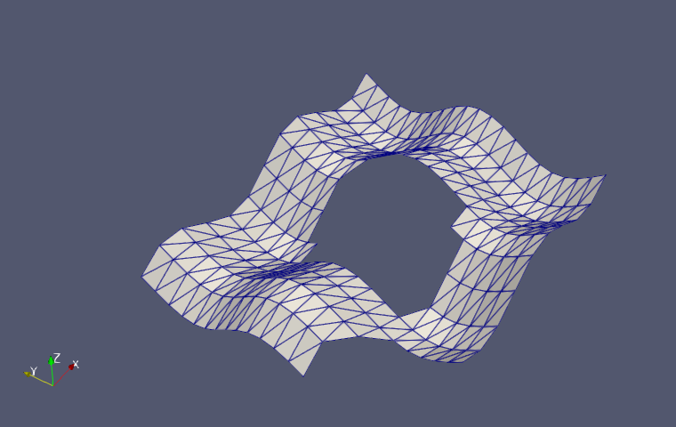
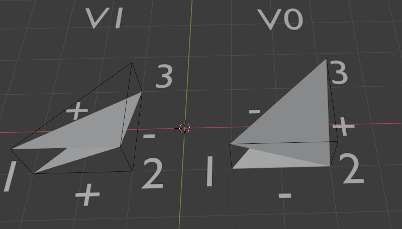
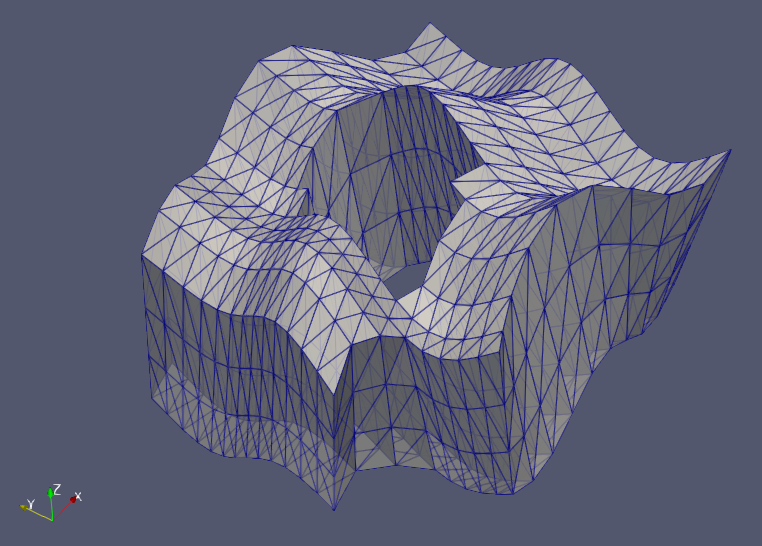
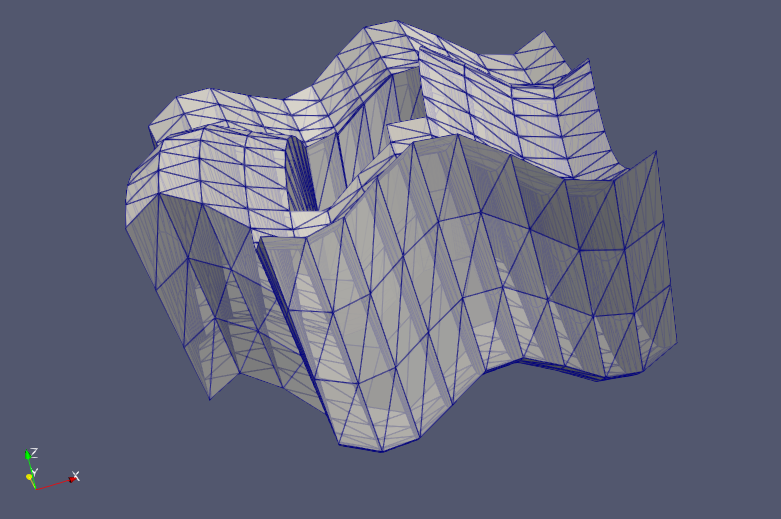
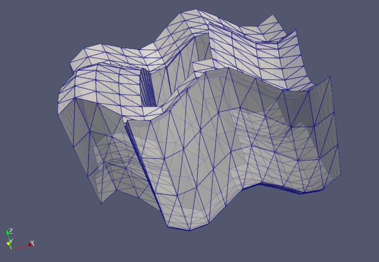
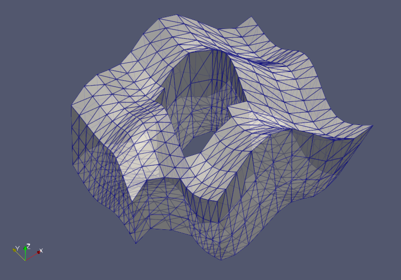

# T4ExtrudeT3

This is a small extension of [FinEtools.jl](https://github.com/PetrKryslUCSD/FinEtools.jl) implementing `T4ExtrudeT3`, which takes an arbitrary triangular surface mesh and extrudes it into a  tetrahedral volume mesh.

**original triangular mesh**

## Naive approach

A triangular extrusion is performed by taking an initial triangle, creating a final triangle, and connecting them with three tetrahedra. 
All of the possible tetrahedral connections can be derived from one another through rotation around the "vertical axis" and "vertical" inversion.
The following diagram shows a pair of vertically inverted tetrahedral connections.

The naive implementation of a triangular mesh extrusion is to orient all extruded tetrahedra identically, but this almost inevitably leads to edge mismatch, where two tetrahedra can have an improper adjacency, where they have coplanar faces which share only two nodes, disagreeing on the third node.

This can at least cause visual artifacts in Paraview as shown below, and can probably also lead to bigger problems in calculations.

**naive extrusion**

## MILP approach

Finding a set of orientations for each elemental extrusion that avoids edge mismatch can be formulated as an integer programming feasibility problem. I was hoping there might be a simpler algorithm (since general integer programming is NP-complete), but I haven't yet thought of one. 
For now, I have a working MILP solution implemented with [JuMP](https://github.com/jump-dev/JuMP.jl) and [Cbc](https://github.com/jump-dev/Cbc.jl).
Notice in the screenshots below, the visual artifacts from above have disappeared, indicating that all adjacent tetrahedrons are properly connected.

**MILP extrusion**

